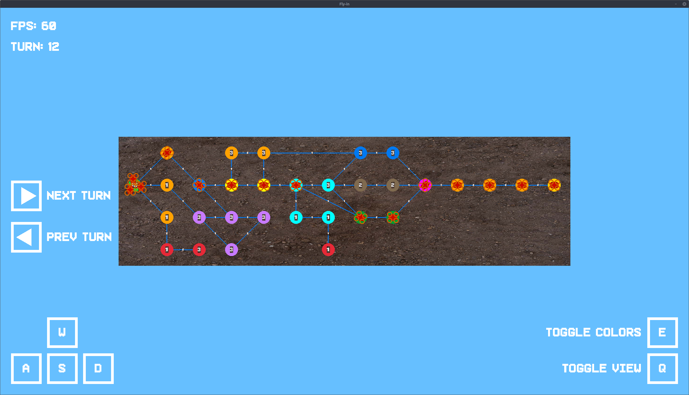
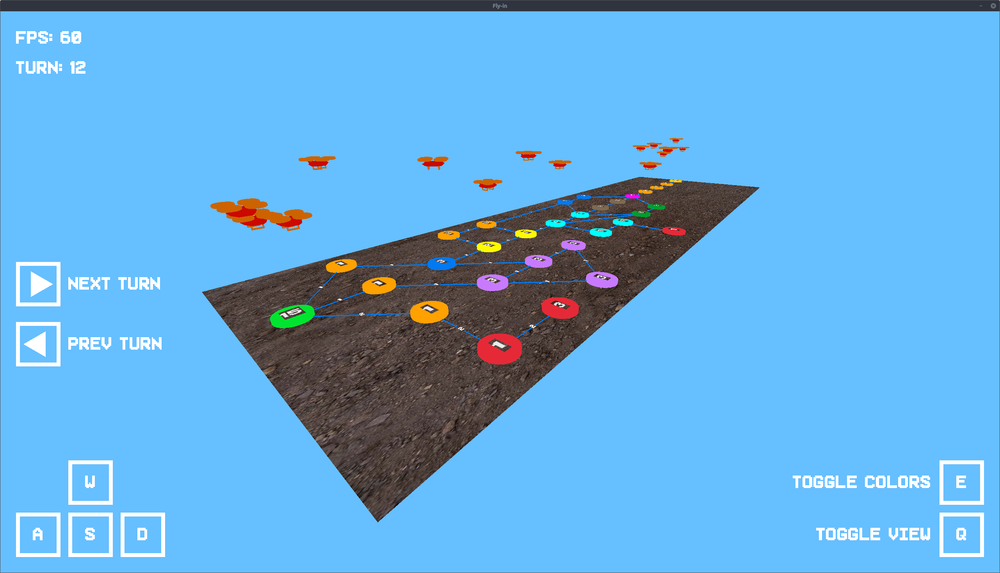

*This project has been created as part of the 42 curriculum by mpouillo.*

# Fly-in

[](https://github.com/mpouillo/42-fly-in/actions/workflows/lint.yml)

- [Description](#description)
    - [Overview](#overview)
        - [Project constraints](#project-constraints)
        - [Map file format](#map-file-format)
        - [Implementation rules](#implementation-rules)
    - [Algorithms and implementation](#algorithms-and-implementation)
    - [Graphical features](#graphical-features)
        - [Overview](#overview-1)
        - [Keybinds](#keybinds)
        - [Screenshots](#screenshots)
- [Instructions](#instructions)
- [Resources](#resources)

## Description

Fly-in is a project written in Python 3.10+. The goal is to design a system that efficiently routes a fleet of drones from a starting point (start) to a target location (end) while following a set of constraints and optimization goals. The graph to navigate is represented as a network of connected zones, where connections define possible movement paths between zones.

### Overview

#### Project constraints

- Any library that helps for graph logic is forbidden (such as networkx, graphlib, etc.).
- The project must be completely typesafe. Using flake8 and mypy is mandatory.
- The project must be completely object-oriented.

#### Map file format

The input file must respect the expected structure and syntax:
- The first line must define the number of drones using nb_drones: <positive_integer>.
- The program must be able to handle any number of drones.
- There must be exactly one start_hub: zone and one end_hub: zone.
- Each zone must have a unique name and valid integer coordinates.
- Zone names can use any valid characters but dashes and spaces.
- Connections must link only previously defined zones using connection: <zone1>-<zone2>
[metadata].
- The same connection must not appear more than once (e.g., a-b and b-a are con-
sidered duplicates).
- Any metadata block (e.g., [zone=... color=...] for zones, [max_link_capacity=...]
for connections) must be syntactically valid.
- Zone types must be one of: normal, blocked, restricted, priority. Any invalid
type must raise a parsing error.
- Capacity values (max_drones for zones, max_link_capacity for connections) must
be positive integers.
- Any other parsing error must stop the program and return a clear error message
indicating the line and cause.

#### Implementation rules

- Drones may move simultaneously.
- On each turn, drones may either move to an adjacent zone, move to an adjacent connection (if headed towards a restricted zone, in which case it MUST reach it on the next turn), or stay in place.
- Drones must respect zone capacity constraints (`max_drones`) and connection capacity (`max_link_capacity`). This means two drones may not enter the same zone on the same turn unless the zone's capacity allows it. The only exception is start and end zones, which can contain all drones simultaneously
- Pathfinding algorithm must take into account the rules of each zone type:
    - `Restricted` zones take 2 turns to be reached
    - `Priority` zones must be preferred in pathfinding
    - `Blocked` zones cannot be accessed
- A visual representation must provide visual feedback of the simulation (through either terminal output or use of a graphical interface)
- The simulation must also output the step-by-step movement of drones from the start to the end zone:
    - Each turn is represented by a line.
    - Each line lists all the drone movements that occurred during that turn. Drones that do not move are omitted.
    - Format : `D<ID>-<zone>`, or `D<ID>-<connection>`

### Algorithms and implementation

The main algorithm used is a modified version of the Dijkstra algorithm, an algorithm used to find the shortest path between nodes in a weighted graph.

Here's a simple explanation of how it works (source: [Wikipedia](https://en.wikipedia.org/wiki/Dijkstra%27s_algorithm#Algorithm)):

1. Create a set of all unvisited nodes: the unvisited set.
2. Assign to every node a distance from start value: for the starting node, it is zero, and for all other nodes, it is infinity, since initially no path is known to these nodes. During execution, the distance of a node N is the length of the shortest path discovered so far between the starting node and N.
3. From the unvisited set, select the current node to be the one with the smallest (finite) distance; initially, this is the starting node (distance zero). If the unvisited set is empty, or contains only nodes with infinite distance (which are unreachable), then the algorithm terminates by skipping to step 6. If the only concern is the path to a target node, the algorithm terminates once the current node is the target node. Otherwise, the algorithm continues.
4. For the current node, consider all of its unvisited neighbors and update their distances through the current node; compare the newly calculated distance to the one currently assigned to the neighbor and assign the smaller one to it. For example, if the current node A is marked with a distance of 6, and the edge connecting it with its neighbor B has length 2, then the distance to B through A is 6 + 2 = 8. If B was previously marked with a distance greater than 8, then update it to 8 (the path to B through A is shorter). Otherwise, keep its current distance (the path to B through A is not the shortest).
5. After considering all of the current node's unvisited neighbors, the current node is removed from the unvisited set. Thus a visited node is never rechecked, which is correct because the distance recorded on the current node is minimal (as ensured in step 3), and thus final. Repeat from step 3.
6. Once the loop exits (steps 3–5), every visited node contains its shortest distance from the starting node.

In my implementation, the provided map data is parsed, stored and computed into a weighted graph, with weight values depending on the type of hubs. Dijkstra is then used to find the shortest path between the start and end hubs while taking into account `priority`, `restricted` and `blocked` zones. Depending on the drone, extra weight is added to hubs blocked by another drone on that turn.

On each turn, every drone recomputes the path between their current position and the end hub. This allows them to dynamically check if they are blocked from moving by another drone on that turn, and update their path accordingly. Their past path data does not change, allowing to go back to previous turns and accurately retrace their path so far.

Using the computed path, each drone updates its current target on every turn and moves to its position.

### Graphical features

#### Overview

A graphical interface is available to visualize the simulation.

Features include:
- 3D/2D view
- First-person view and free movements
- Drone animation
- Toggling better colors for zone types
- Going forward/backward in time
- Key display HUD

#### Keybinds

| KEY           | Action                                |
|---------------|---------------------------------------|
| W             | Move forward                          |
| A             | Move left                             |
| S             | Move backward                         |
| D             | Move right                            |
| Space         | Move up                               |
| C             | Move down                             |
| Q             | Toggle view (3d <-> 2D)               |
| E             | Toggle colors (map data <-> zone type)|
| Left Arrow    | Play previous turn                    |
| Right Arrow   | Play next turn                        |

#### Screenshots

- 2D View
<div align=center></div>

- 3D View
<div align=center></div>

## Instructions

Run the program using the provided Makefile:
```shell
$> make run MAP=<path_to_map_file>
```

Or, alternatively (provided `uv` is installed):
```shell
$> uv run python -m src <path_to_map_file>
```

To remove any temporary files (`__pycache__` or `.mypy_cache`), run:

```shell
$> make clean
# Cleaning cache files...
```

To clean up installed environment files, run:

```shell
$> make fclean
# Removing Miniconda directory...
```

## Resources

- [Representing graphs data structure in Python (stackoverflow)](https://stackoverflow.com/questions/19472530/representing-graphs-data-structure-in-python)
- [Raylib Cheatsheet](https://www.raylib.com/cheatsheet/cheatsheet.html)
- [raymath.h source code @ github](https://github.com/raysan5/raylib/blob/master/src/raymath.h)
- [Pyray Docs](https://electronstudio.github.io/raylib-python-cffi/index.html)
- [Raylib Package Docs](https://pub.dev/documentation/raylib/latest/raylib/)
- [Dijkstras Shortest Path Algorithm Explained | With Example | Graph Theory](https://www.youtube.com/watch?v=bZkzH5x0SKU)
- [Shortest path unweighted graph (GeeksForGeeks)](https://www.geeksforgeeks.org/dsa/shortest-path-unweighted-graph/)
- [Dijkstra Algorithm (GeeksForGeeks)](https://www.geeksforgeeks.org/dsa/dijkstras-algorithm-for-adjacency-list-representation-greedy-algo-8/)
- AI was not used at any point during this project.

[Screenshot_2D]: assets/screenshot_2d.png
